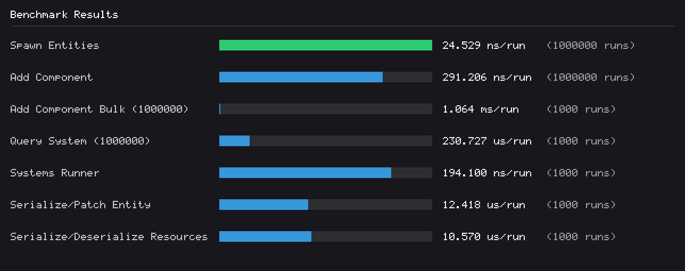

# Benchmark Results

| Benchmark | Elapsed | Runs | Average | Bytes |
| :--- | :--- | :--- | :--- | :--- |
| Spawn Entities | 26.244 ms | 1000000 | 26.244 ns/run | 32.01MiB |
| Add Component | 296.788 ms | 1000000 | 296.788 ns/run | 14.63KiB |
| Add Component Bulk (1000000) | 1.126 s | 1000 | 1.126 ms/run | 63.64MiB |
| Query System (1000000) | 148.077 ms | 1000 | 148.077 us/run | 47.64MiB |
| Systems Runner | 96.500 us | 1000 | 96.500 ns/run | 40.02MiB |
| Scheduler 7 labels, 100 systems, 100k entities | 979.843 ms | 100 | 9.798 ms/run | 31.84MiB |
| Serialize/Patch Entity | 12.906 ms | 1000 | 12.906 us/run | 16.41KiB |
| Serialize/Deserialize Resources | 11.067 ms | 1000 | 11.067 us/run | 11.17KiB |
