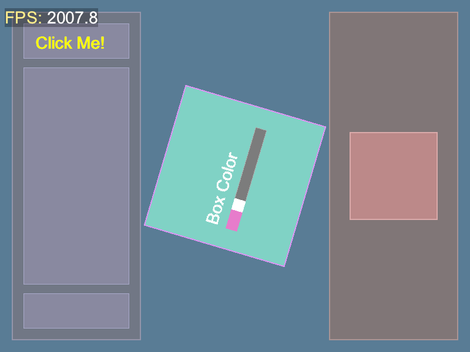

> Geri is one of Odin’s two wolves (Geri and Freki)

## Geri

Geri is a ECS (Entity Component System) framework for Odin inspired by [Bevy](https://bevyengine.org/).




## Why Odin?

It is actually pretty good. Would be nice if it supported methods but at least ols allows "fake methods" as a config option.

## Test

```bash
mise test
```

```bash
mise bench
```

## Examples That Are Really Just Tests

### UI

```bash
mise test-ui
```

### UI On 3D Sphere

```bash
mise test-ui-3d
```

### Shader

```bash
mise test-shader
```

### Circles/Text (bbcode formatted)

```bash
mise test-render
```

### License

Source code is under MIT. See [LICENSE](LICENSE) for details.
