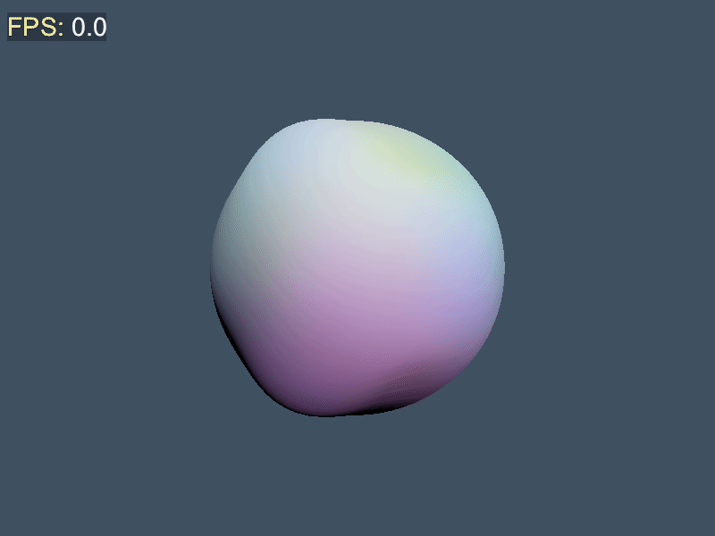

> Geri is one of Odin’s two wolves (Geri and Freki)

## Geri

Geri is a ECS (Entity Component System) framework for Odin inspired by [Bevy](https://bevyengine.org/).



> [!NOTE]
> It runs smooth but gif generation is glitchy, try running on your system (`mise test-shader`) and if you are not using windows, change the font path to a font available on your system.

## Test

```bash
mise test
```
```bash
mise bench
```

## Packages

## benchmark

Geri includes a robust benchmarking wrapper package built on top of `core:time` for measuring execution times and memory allocations.

### Features
- **Isolated Memory Allocation Tracking**: Utilizes a custom tracking allocator wrapper that isolates and records memory allocations strictly during the benchmark loop itself. Any memory allocated during `setup` and freed during `teardown` is ignored, preventing noise in peak memory reporting.
- **Multiple Output Formats**: Supports output to `console`, `markdown`, `html`, and `graph` (BMP plots). Configurable via the `BENCH_FORMAT` environment variable (e.g., `BENCH_FORMAT=console;markdown;graph`).
- **Flexible Execution**: Supports simple inline benchmarking or advanced run loops with isolated setup/teardown hooks.

### Simple Benchmark Example

```odin
package main

import bench "geri/benchmark"
import "core:time"
import "core:mem"

main :: proc() {
	// Simple inline benchmark
	bench.run("Integer addition", 1_000_000, nil, proc(opts: ^time.Benchmark_Options, allocator: mem.Allocator) -> time.Benchmark_Error {
		a, b := 1, 2
		for _ in 0 ..< opts.count {
			_ = a + b
		}
		return .Okay
	})
}
```

### Advanced Benchmark Example (with Setup/Teardown and Memory Isolation)

```odin
package main

import bench "geri/benchmark"
import "core:time"
import "core:mem"

main :: proc() {
	opts := time.Benchmark_Options {
		count = 1_000,
		setup = proc(opts: ^time.Benchmark_Options, allocator: mem.Allocator) -> time.Benchmark_Error {
			// 1. Setup allocations here are NOT counted towards peak benchmark bytes
			data := new(int, allocator)
			opts.user_data = data
			return .Okay
		},
		bench = proc(opts: ^time.Benchmark_Options, allocator: mem.Allocator) -> time.Benchmark_Error {
			// 2. Only allocations inside this bench block are measured
			ptr := cast(^int)opts.user_data
			for _ in 0 ..< opts.count {
				ptr^ += 1
			}
			return .Okay
		},
		teardown = proc(opts: ^time.Benchmark_Options, allocator: mem.Allocator) -> time.Benchmark_Error {
			// 3. Clean up setup resources
			free(opts.user_data, allocator)
			return .Okay
		},
	}

	bench.run("Counter Benchmark", &opts)
}
```

## logging/bbcode
Geri's logging system supports a more advanced BBCode-like tags for rich text formatting in log messages. These tags allow you to apply styles such as bold, italic, underline, strikethrough, and colors to specific parts of your log output. The logging system includes a BBCode parser that translates these tags into ANSI escape codes for terminal output, enabling visually distinct log messages based on log level, context, or content. You can also define custom tags and functions for dynamic log formatting, making it easy to highlight important information or differentiate log messages in a visually appealing way.

## License

Source code is under MIT.  See [LICENSE](LICENSE) for details.

geri.png is AI generated by Google Gemini.  The image is licensed under [CC0](https://creativecommons.org/publicdomain/zero/1.0/legalcode.txt) and can be used freely.